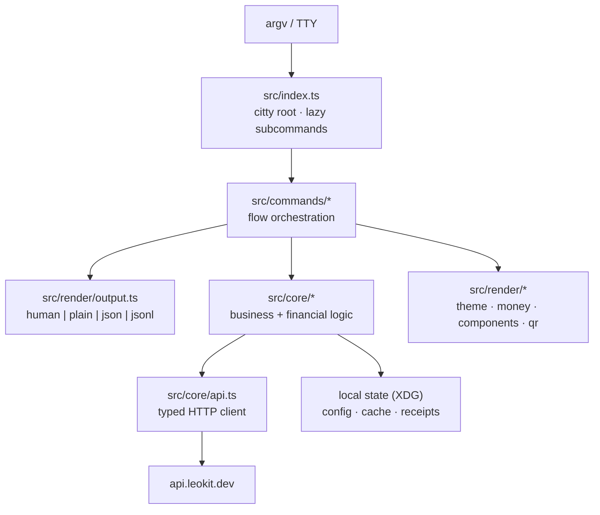

# Architecture

One engine, three faces: the same core serves interactive humans, `--json`
agents, and `--jsonl` bots. Renderers never compute money; core never prints.

## Stack

citty (parser, lazy subcommands — ~260ms cold start) · @clack/prompts ·
picocolors · qrcode (QRs render locally, always) · zod · viem (bot signer
only) · native BigInt decimal math. Deliberately **not** Ink: a swap funnel
wants an append-only scroll-back transcript and pipe-safety.

## File map

| Path | Responsibility |
| --- | --- |
| `src/index.ts` | Root command + intent menu |
| `src/commands/` | One file per command; `shared.ts` holds prompt helpers |
| `src/core/api.ts` | Every endpoint; defensive error parsing; bigint-preserving JSON; SSE generator |
| `src/core/amount.ts` | Exact decimal↔BigInt conversion — the only place money math lives |
| `src/core/assets.ts` | Asset cache (24h, gzip), resolution grammar, chain-ranked search |
| `src/core/quotes.ts` | Streamed route collection, normalization, local ranking |
| `src/core/deposit.ts` | Deposit preparation + the validation gauntlet (protocol match, exact amounts, URI checks) |
| `src/core/status.ts` | Status normalization + poll engine (backoff + jitter) |
| `src/core/receipts.ts` | Durable receipt store (atomic writes) |
| `src/core/credentials.ts` | env → OS keychain → community key; redaction |
| `src/core/policy.ts` / `flightlog.ts` / `idempotency.ts` | Bot substrate |
| `src/core/signer/evm.ts` | Opt-in EVM signer (env key / V3 keystore), simulate-first |
| `src/core/feedback.ts` | Feedback reports, redaction, offline outbox |
| `src/render/` | Theme + capability detection, money formatting, components, QR, JSON envelopes |
| `src/render/otto.ts` | The mascot: half-block ANSI renderer + menu banner, driven by `brand/otto.pixels.json` |
| `brand/` + `scripts/gen-brand.mjs` | Brand kit — every asset generated from the pixel source (see [brand/BRAND.md](../brand/BRAND.md)) |

## Design rules that keep it safe

1. Quote responses parse through `parseJsonPreservingBigInts` — base-unit
   amounts exceed JavaScript's safe-integer range in production.
2. Deposit amounts are recomputed with exact integer math and validated
   against the payment URI before any QR renders; mismatches downgrade to
   address-only display.
3. Receipts are written before payment instructions are shown; every swap is
   resumable after a crash.
4. Route discovery streams (SSE) so every provider gets its window and the
   picked route can't vanish at deposit time.
5. State-changing calls are never auto-retried; `--dry-run` performs none.

## Extending

**New command**: add `src/commands/<name>.ts`, register the lazy import in
`src/index.ts`, accept the standard mode flags, route output through
`resolveOutput`/`emitData`/`failWith`, document it in `docs/commands.md` (+
`AGENT-CONTRACT.md` if agent-relevant). **New flag**: mirror an existing one (see
`assets list --limit`), keep JSON additive, update docs in the same change.
**New endpoint**: add a typed method on `LeoKitApi`, wire types, and a
normalizer in core — commands never consume wire shapes directly.
